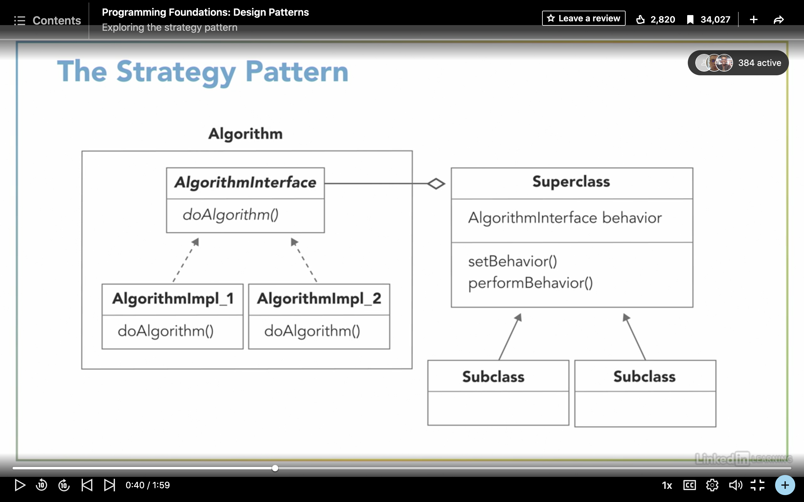
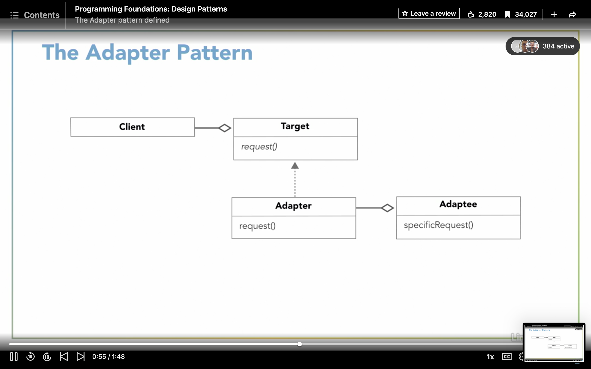
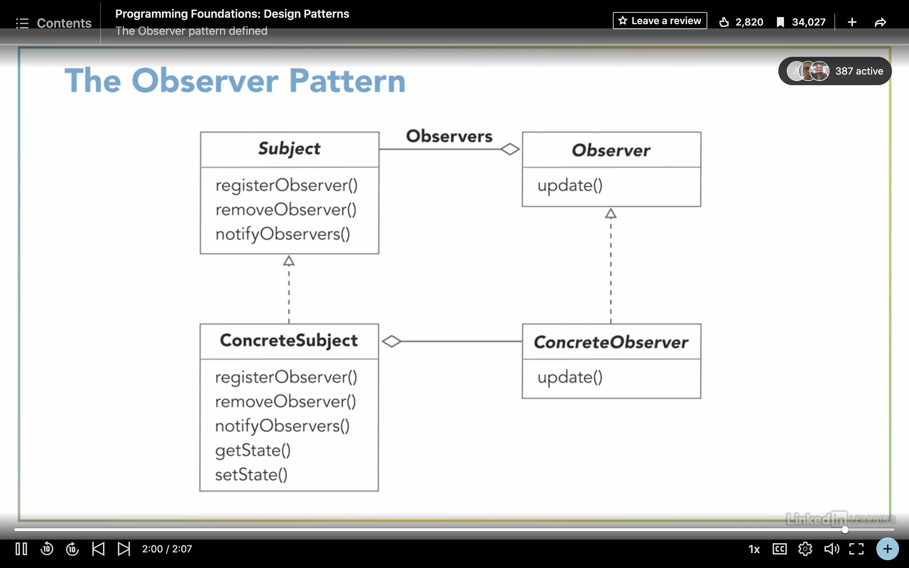
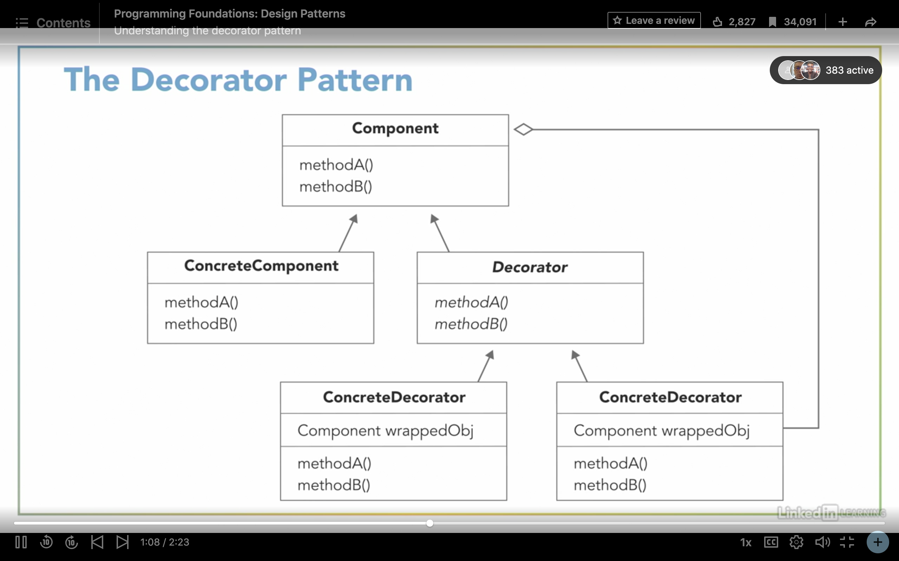
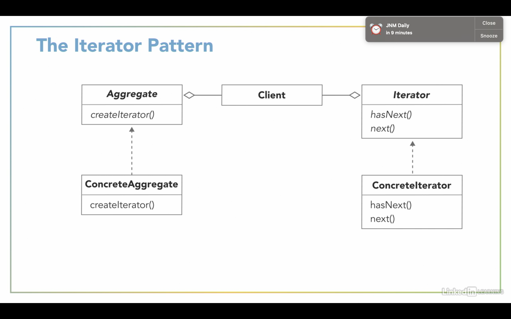
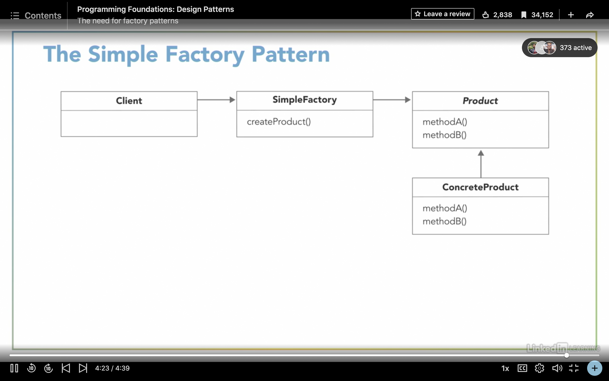

# Programming Fundamentals: Design Patterns
Excerpts form the LinkedIn Learning Course: 

## Design Principles
- Separate (encapsulate) what varies
- Program to an interface, not an implementation
- Favour composition over inheritance (for code reuse)
- Strive for look coupling between classes
- Single responsibility principle: A class should have only one reason to change
- Open-Closed Principle: Classes should be open for extension but closed to modification
- Liskov Substitution: Superclasses should be substitutable with their subclasses
- Interface Segregration: Classes should not be forced to implements methods they do not need
- Dependency inversion: High-level components should not depend on low-level components. Rather, both should depend on abstractions. Also, implementations should be tailored to abstractions (not the other way around).

## Design Patterns
### Strategy Pattern
Defines a family of algorithms, encapsulates each one, and makes them interchangeable. Lets the algorithms vary independently from the clients that use them.
 

### Adapter Pattern
Converts the interface of a class into another interface that clients expect. It allows classes to work together that couldn't otherwise because of incompatible interfaces.
 

### Observer Pattern
Defines a on-to-many relationship between objects, such that when the state of one object changes, all of its dependents are notified and updated automatically.
 

### Decorator Pattern
Attaches additional responsibilities to an object dynamically.
Provides a more flexible way for extending functionality (as compared to subclassing).
 

### Iterator Pattern
Provides a means of accessing the elements of an aggregate object sequentially, without exposing its underlying implementation.
 

### Simple Factory Pattern
Allows us to decouple the process of creating objects from the clients that use those objects.
 

### Factory Method Pattern
Defines an interface for creating an object but lets subclasses decide which class to instantiate.
